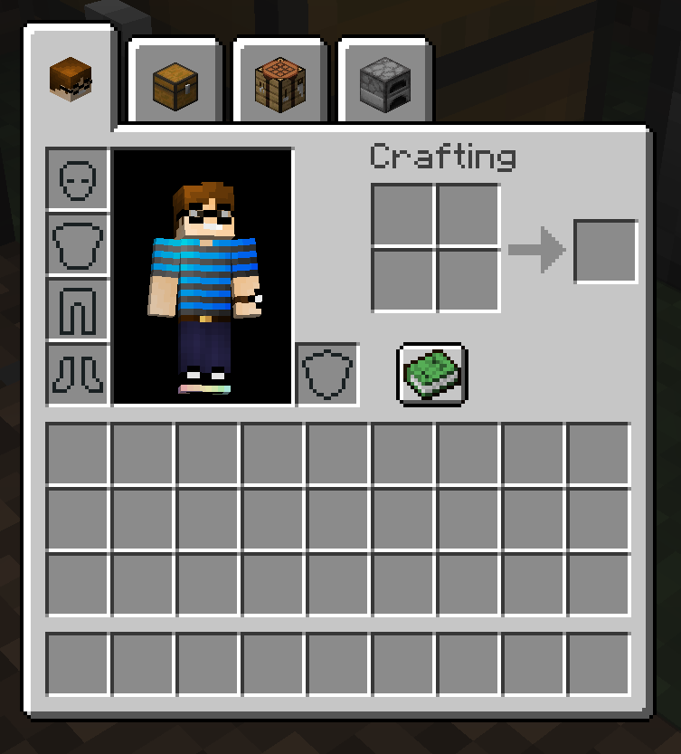
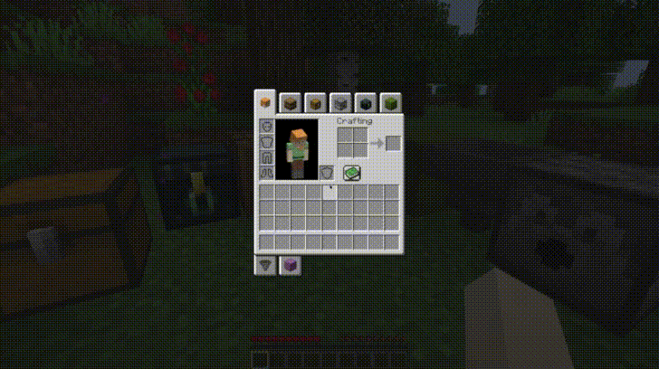
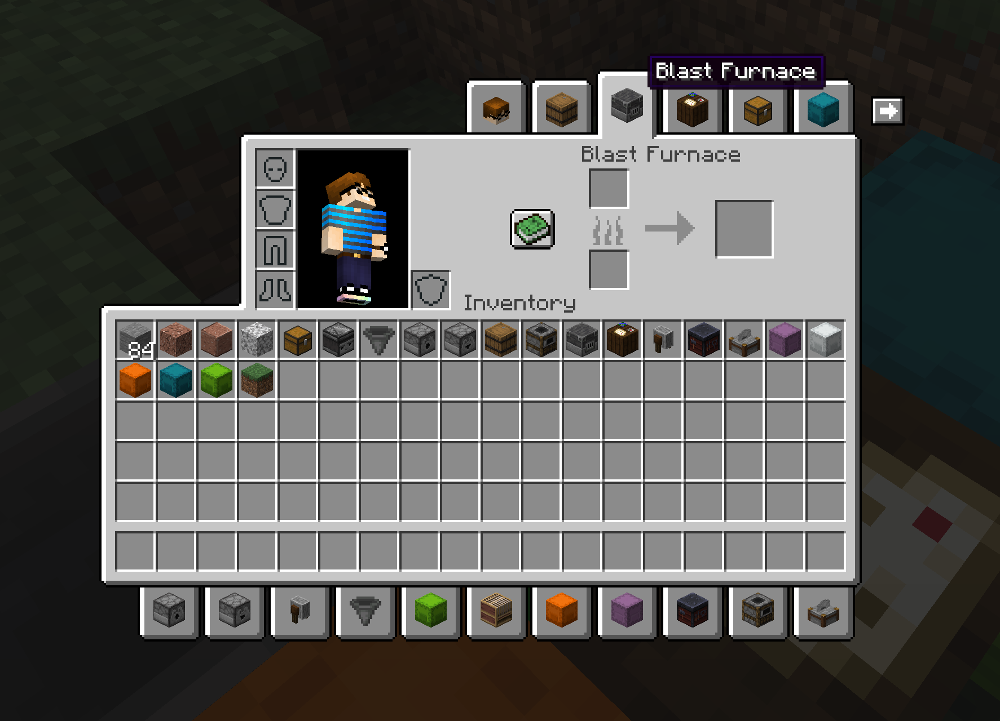

# InventoryTabs
Adds tabs to access nearby blocks without leaving your inventory. Completely client-side. Requires Cloth Config API.




Also has [BigInv](https://github.com/SollyW/BigInv) support!


## Devs
### Importing
To add **Inventory Tabs** to your project, you need to add ``https://jitpack.io`` as a repo and ``com.github.Andrew6rant:inventorytabs:(mod version)-(Minecraft version)`` as a dependency. For example:
```
repositories {
	maven {
		url "https://jitpack.io"
	}
}

dependencies {
	modImplementation "com.github.Andrew6rant:inventorytabs:0.4.4-1.18.x"
}
```

See the releases page for available versions.

### Adding Custom Tabs
There are multiple ways to add custom tabs.

#### Simple Block Tabs
A "simple block tab" is a tab that is opened via interaction with a block. If your block falls under this category, adding a tab is as easy as passing your block to ``TabProviderRegistry#registerSimpleBlock``.

#### Chest Tabs
Chest tabs are tabs belonging to chests that are able to double up along the horizontal axis. To register your chest, pass the block reference to ``TabProviderRegistry#registerChest``. Chests that do not match vanilla chest behavior should not use this method.

#### Custom Tabs
The first step to adding a custom tab is creating a class that implements the ``Tab`` interface. This represents the tab that players will see, and it also controls what happens when the tab is clicked.

The next step is to register a ``TabProvider`` using the ``TabProviderRegistry``. ``TabProvider`` objects are called every tick while a screen is open in order to populate the list of tabs available to the player. The list is not managed by the mod, so be sure to check for duplicates yourself. The ``GenericBlockTabProvider`` class is provided, and serves as a basis for adding tabs for blocks that open handled screens (it also checks for duplicates for you). Feel free to see the ``EnderChestTabProvider`` and ``ShulkerBoxTabProvider`` classes for implementation details.

Your handled screen needs to update the ``TabManager``, which you can grab a reference of by calling ``TabManager#getInstance``. In the ``init`` method (not your constructor), you **must** call ``TabManager$#onScreenOpen``. After doing that, you need to do a check to see if your screen was opened via tab or other means. If it **wasn't** opened via tab (check by calling ``TabManager#screenOpenedViaTab``), call ``TabManager#onOpenTab`` with your ``Tab`` object. See ``VanillaScreenTabAdder`` for more details on how to do this. You can also adjust the y-axis positioning of the bottom row of tabs by setting ``TabRenderer#bottomRowYOffset`` (there is a reference to a ``TabRenderer`` object in the ``TabManager``).

Finally, there are some methods to call for rendering and managing the tabs. In the ``render`` method before anything is drawn, call ``TabRenderer#renderBackground``. In the ``drawBackground``, call ``TabRenderer#renderForeground`` and ``TabRenderer#renderHoverTooltips``. In the ``mouseClicked`` method, call ``TabManager#mouseClicked``.

If your screen's GUI dynamically changes (in the case of a recipe book opening), you can implement the ``TabRenderingHints`` interface and offset the top and bottom rows however you like.

## Credits
This 1.18 port is based on LiamMCW's fork of the original mod by cakewhip. Full credits can be found at https://github.com/Andrew6rant/inventorytabs/graphs/contributors.
